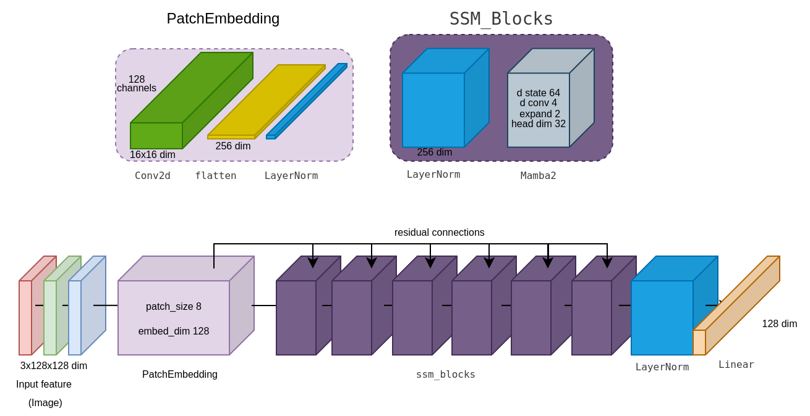
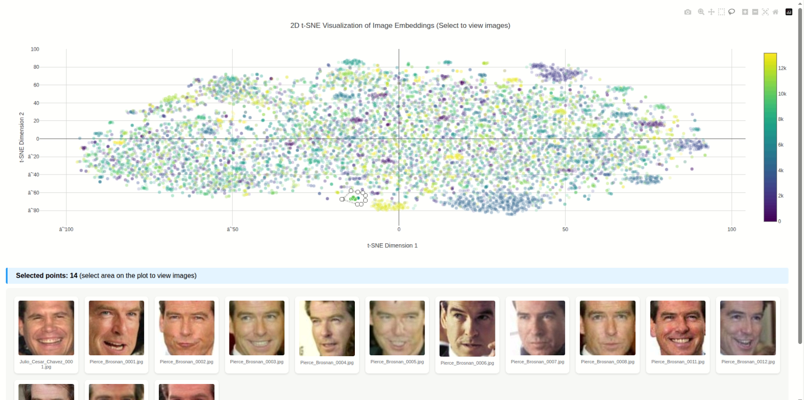

# Face Recognition Neural Network

**Проект, реализующий архитектуру нейронной сети для распознавания лиц.**

Этот репозиторий содержит реализацию нейронной сети, построенной с использованием компонентов:

-   **Mamba**: Используется в качестве эффективного feature extractor.
-   **Сверточные слои**: Применяются для patch embedding.
-   **Hydra**: Управляет конфигурациями обучения, логированием и созданием артефактов.

> **Важное замечание:** Проект разработан для запуска **только на GPU с поддержкой CUDA**.

---

## Установка

Чтобы подготовить окружение для работы, следуйте одному из предложенных способов.

### Conda (рекомендуется)

```bash
conda env create -f environment.yml
conda activate regssm
```

### Virtualenv / Pip

```bash
python -m venv venv
source venv/bin/activate 
pip install -r requirements.txt
```

---

## Датасеты

Для обучения и построения эмбеддингов использовались следующие наборы данных:

-   **Для обучения:** [LFW People Dataset](https://www.kaggle.com/datasets/atulanandjha/lfwpeople)
-   **Для эмбеддингов:** [Face Recognition Dataset](https://www.kaggle.com/datasets/vasukipatel/face-recognition-dataset)

---

## Запуск

### Запуск обучения

Обучение запускается через скрипт `scripts/train.py`. Параметры можно передавать как через командную строку, так и через конфигурационные файлы. Все результаты экспериментов сохраняются в директорию `outputs`.

**Через CLI:**

```bash
python scripts/train.py data_path="path/to/your/dataset" epochs=100 lr=0.01
```

**Через YAML:**

Конфигурация будет автоматически подхвачена из `configs/train_config.yaml`.

```bash
python scripts/train.py
```

### Мониторинг обучения

Процесс обучения можно отслеживать в реальном времени с помощью TensorBoard.

```bash
tensorboard --logdir="path/to/outputs"
```

### Другие скрипты

В проекте также доступны следующие утилиты:

-   `predict`: Оценка схожести двух лиц.
-   `eval`: Валидация модели на тестовом наборе данных.
-   `emb_visualize`: Построение и визуализация эмбеддингов для изображений.
    > В папке `artifacts` доступен `html`-файл с интерактивной визуализацией эмбеддингов, построенной с помощью Plotly.

Запуск этих скриптов аналогичен обучению — через CLI или YAML-конфиги.

---

## Тесты

Для проверки корректности работы основных модулей и функций используются тесты на `pytest`.

```bash
pytest
```

---

## Архитектура сети

Визуализация архитектуры модели:



## Визуализация эмбеддингов

Визуализация работы эмбеддингов:



> html файл находится в папке `artifacts`.

**Ключевые компоненты архитектуры:**

-   **Patch Embedding**: Реализован с помощью сверточных слоев для преобразования изображений в последовательности.
-   **Feature Extractor**: В качестве основы используется блок **Mamba**.
-   **Основная структура**: Представляет собой стек сверточных и нормализующих блоков с `residual connections` для стабильного обучения.

---

## Концепция проекта и результаты

Этот проект создавался в первую очередь как "игрушечный" — его главной целью было исследовать, какой результат можно получить, интегрировав **Mamba** в архитектуру для распознавания лиц.

### Стратегия обучения и результаты

В текущей реализации используется **Triplet Loss** для обучения модели различать лица. Этот подход направлен на минимизацию расстояния между эмбеддингами одного и того же человека и максимизацию расстояния между эмбеддингами разных людей.

Тактика обучения состояла из двух этапов:
1.  **Первый этап (~100 эпох):** Обучение на всех доступных сэмплах (`all`) с `patch_size=8`, `batch_size=1024`, `lr=0.003` и `warmup` в течение 10 эпох.
2.  **Второй этап:** Дообучение модели только на "сложных" примерах (`hard`), которые модель путала на первом этапе.

В результате удалось достичь следующих метрик:
-   **Train Loss:** 0.2001
-   **Recall@1:** 0.7439
-   **R-Precision:** 0.3539
-   **MAP@R:** 0.2822

> Обученная модель с лучшими весами сохранена в папке `artifacts`.

### Направления для улучшения

-   **Выбор Backbone**:
    > В реальной продуктовой задаче для достижения максимальной точности было бы целесообразнее использовать проверенные временем архитектуры, такие как **ResNet** или **Vision Transformer (ViT)**, в качестве основы (backbone).

-   **Функция потерь**:
    > Для достижения лучших результатов стоит поэкспериментировать с другими функциями потерь (например, **ArcFace** или **CosFace**), которые часто показывают более высокую производительность в задачах распознавания лиц.

-   **Размер эмбеддинга**:
    > В данной модели размер эмбеддинга был установлен равным 128. Хотя для задач распознавания лиц часто используются большие размеры (например, 256 или 512) для более точного представления признаков, выбор был сделан в пользу меньшего размера, поскольку цель эксперимента заключалась не в достижении SOTA-результатов, а в быстрой проверке гипотезы о применимости Mamba и создании демонстрационного прототипа.